# Durable inference and input cutover

RFC #27 keeps one continuous context per conversation. It separates model output
commitment, tool execution and message delivery. An expedite invalidates the
current decision, gives the active stream a bounded drain period, then appends
eligible inputs to the same context. It preserves each input's ID and task.

## Identities and state

`inference_requests` identifies a logical inference; `inference_attempts`
identifies each network attempt. Both retain the originating run and task.
`leaseEpoch` checks worker ownership. `decisionRevision` uses the existing
`conversations.generation` fence. `contextSeq` identifies committed history.
Each conversation permits one open logical request, with one open attempt.

| Output item state | Meaning | Used in a later model request |
| --- | --- | --- |
| streaming | Content is arriving. | No. |
| closed | Content ended; continuation data or the protocol group can still be incomplete. | No. |
| committed | The adapter confirmed replay readiness and the history transaction committed. | Yes, subject to the selected model's protocol. |
| discarded | The stream ended before the item became replayable. | No; its visible diagnostic record can remain. |

```mermaid
flowchart LR
    A[Input accepted with original ID] --> B[Invalidate old decision]
    B --> C[Drain active stream within deadline]
    C --> D[Commit complete protocol groups]
    D --> E[Discard unfinished items]
    E --> F[Append eligible inputs and mark read]
    F --> G[Refresh prompt and tools]
    G --> H[Check lease and decision before dispatch]
    H --> I[Next inference in the same context]
```

Requests and attempts move through `prepared`, `streaming`, `cutting`, `settling`
and `sealed`. A sealed attempt rejects later output. Stop, takeover and expired
leases retire unfinished attempts immediately. Recovery keeps committed items,
discards volatile items and resumes original tool receipts. A newer worker's
lease prevents an old stream from changing history.

## Adapter capabilities

Capabilities are selected by PI API identifier, rather than a provider's display
name. `PiEvents` copies PI's mutable blocks into normalized events. Content
closure is separate from continuation readiness.

| API | Commit boundary | Required continuation |
| --- | --- | --- |
| `openai-responses`, `azure-openai-responses`, `openai-codex-responses` | Complete native output groups can commit before the whole response ends. | Original item identity and valid status; reasoning requires encrypted content and a following complete text or tool item. |
| `anthropic-messages` | Complete assistant response/group. | Native thinking signature and a complete group with following output. |
| Other supported PI APIs | Complete response. | The adapter's terminal representation. |

Responses items marked `in_progress` or `incomplete` stay uncommitted even if an
item-done event arrived. Azure-style encrypted content that arrives at the
terminal event can complete a pending group during the drain. An incomplete
group is never converted to a plain-text thinking summary for replay. Switching
model, provider or API removes earlier private reasoning from the wire
projection; ordinary conversation history remains available.

The pinned PI 0.85.0 patch in `patches/` preserves native item IDs, status and
payload at item-done, including late encrypted continuation. It replays native
items only for the same model, provider and API. The application validates
readiness before commitment. The patch is registered in the workspace and
lockfile, so production `pnpm deploy --prod --config.inject-workspace-packages=true`
uses it too. A PI upgrade must revalidate native item preservation and the
packaged dependency before removing or rebasing this patch.

All current adapters use bounded drain and committed-history recovery.
`INTRICA_INFERENCE_SETTLE_MS` defaults to 1,000 ms;
`INTRICA_INFERENCE_IDLE_MS` defaults to 300,000 ms. A worker stop cancels the
transport immediately. Native provider steering remains disabled: PI does not
expose a verified acknowledgement and reconnect contract for these queues.

## Tools and retries

A complete group and its checkpoint commit in one canvas transaction before tool
admission. The durable executor validates arguments, current authority, task,
lease and decision before claiming dispatch. If expedite wins that transaction,
the tool returns `superseded_before_dispatch` with `executed=false`. If dispatch
wins, the original operation and its receipt remain authoritative.

Each native call has one stored `primary_response`. Fast tools return their
result directly. A long tool returns a real `running` receipt after the async
threshold, or sooner when expedite interrupts its wait. A dependent operation
can return `queued` while an earlier effect runs. Completion arrives as an update
linked to the original call and work item, rather than a second native response
with the same call ID. Independent reads can run in parallel. Dependent effects
follow the existing receipts. The registry marks message, team, permission and
conversation tools as coordination operations. They can proceed while resource
effects run, with their normal permission and transaction checks; they do not
establish completion of those effects. Explicit outcome verification supplies a missing
primary response but preserves a primary response that already exists.

The inference coordinator owns retries. SDK retries are disabled. It can retry
an attempt with no committed work, or continue from the latest committed context
and original tool responses after a partial commit. Backoff ends when expedited
input arrives. The final dispatch fence runs after payload construction and
diagnostic capture. Unknown external outcomes block automatic replay until
explicitly resolved. Arbitrary external effects do not have an exactly-once
guarantee.

## Context, prompts and publication

`context_entries` stores immutable messages with sequence, hash, input references
and item versions. Item commitment, checkpoint and input consumption share the
same transaction. A rolled-back in-memory sequence is checked against the saved
entry hash before reuse. These records are private runtime history, distinct
from optional diagnostic payload capture.

Compaction uses one fixed committed snapshot. Its request contains a serialized
source transcript, rather than replayed native assistant blocks. The manifest
records the snapshot head, summarized sequences, source hash and any retry
excerpt bounds. Retained tail sequences remain separate from summarized coverage.
Inputs received during compaction stay unread until appended before the next
inference. Open requests and tool ownership remain in business tables.

Each actual attempt records a version-2 model-call manifest: projected input IDs,
item versions, context sequences, message hashes, current tools, prompt version,
model configuration and effective payload hash. Later checkpoint changes cannot
rewrite that attempt's manifest. The default trace exposes identities and hashes,
not native continuation payloads. Optional redacted diagnostics retain their
existing retention and clear-policy fences.

English and Chinese prompts are rebuilt from the current capability snapshot
before each attempt, including retries and the closing stage. They describe one
continuous context, read receipts, original tool ownership, `running`/`queued`
receipts and explicit message delivery. The same `send_message` contract and
final target JSON remain in force. The closing stage retains final JSON guidance
with an empty tool list. Execution checks current authority again at admission.

Context commitment is separate from publication. A final candidate goes through
the existing generation-fenced `MessageService` transaction. A stale candidate
stays unpublished; a winning delivery keeps its real receipt. Publication adds a
diagnostic annotation and leaves immutable model history unchanged. Other Agents'
conversation tools exclude private inference items.

The UI restores item state from durable records after refresh or reconnect.
Its disclosures distinguish generating, awaiting continuation, committed and
interrupted records. Text items show delivery separately. Full record expansion
loads long content in place. Input receipts distinguish accepted/unread, expedite
drain and committed/read; read status makes no claim about task completion.

## Validation and boundaries

The `inference-*` PostgreSQL suites use controlled HTTP/SSE endpoints and the real
PI serializers. They inspect actual successor payloads, manifests, receipts,
dispatch counts and publication rows. Gates and committed database notifications
control the races. Coverage includes late native fields, incomplete status,
multiple expedites, preparation, dispatch and publication races, long effects, retry backoff,
lease loss, all request states, compaction, rollback and schema 15-to-16 upgrade.
Prompt contract tests cover four roles, two languages, changing permissions,
available tool subsets and closing output. Browser tests restore committed and
interrupted records and load full content after reload.

Opaque signature and encryption fixtures establish field preservation and
protocol ordering, not cryptographic acceptance by a live provider. Live-model
reasoning quality and native steering are separate evaluations. The deployment
check exercises an isolated production dependency tree on the development
platform; the Linux release artifact still needs its normal platform build.

Sources: [Responses streaming events](https://developers.openai.com/api/reference/resources/responses/streaming-events),
[reasoning](https://developers.openai.com/api/docs/guides/reasoning),
[steering](https://developers.openai.com/api/docs/guides/steering).

## Module ownership

- `inference/`: logical requests, attempts, item commits, context projection,
  input cutover, retry decisions, retirement and recovery.
- `adapters/model/`: PI event normalization, native continuation and one transport
  attempt. It supplies no hidden retry loop.
- `work/`: task selection, prompt construction, compaction, checkpoints and tool
  admission. The same admission path drains restored and streamed groups.
- `execution/`: leases, durable tool dispatch, dependency order and tool receipts.
- `collaboration/`: addressed messages, permissions, input urgency and delivery.

Runtime imports remain acyclic. Inference and execution depend on work interfaces
through type-only links and callbacks.
